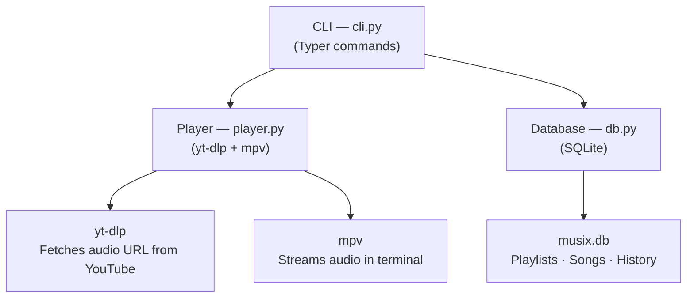
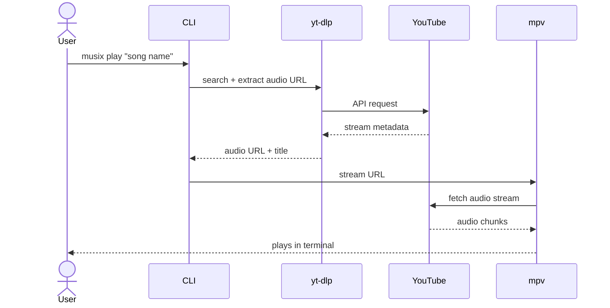

# Musix — Terminal Music Player

Built for developers who live in the terminal.

Music Apps has ads, skip limits, and pulls you out of your flow. Browser players eat RAM. Musix lets you search and stream any song without leaving the terminal — no account, no browser, no interruptions.

---

## Why Musix

- **Zero context switching** — stay in the terminal, stay in flow
- **Low RAM** — mpv + a small Python process, no Electron overhead
- **No constraints** — no skip limits, no ads, no subscription
- **No account needed** — just install and play

---

## Prerequisites

`mpv` must be installed on your system:

| Platform | Command |
|----------|---------|
| Linux | `sudo apt install mpv` |
| Mac | `brew install mpv` |
| Windows | `scoop install mpv` |

---

## Installation

```bash
pip install musix-cli-player
```

---

## Commands

### Playback
```bash
musix play "song name"                        # Stream a song instantly
musix search "song name"                      # Search and pick from top 5 results
musix play-playlist "playlist name"           # Play all songs in a playlist
```

### Download
```bash
musix download "song name"                    # Search and download as audio file
                                              # Saves to ~/Music/musix/
```

### Playlists
```bash
musix playlist "My Playlist"                  # Create a playlist
musix add-song "song name" "My Playlist"      # Add a song to a playlist
musix delete-playlist "My Playlist"           # Delete a playlist and its songs
musix list-playlists                          # List all playlists
```

### History
```bash
musix history                                 # Show last 20 played songs with links
```

---

## Playback Controls

While a song is playing:

| Key | Action |
|-----|--------|
| `p` or `Space` | Play / Pause |
| `q` | Skip to next / Quit |
| `9` / `0` | Volume down / up |

---

## How It Works

1. **Search** — yt-dlp queries YouTube and returns results
2. **Stream** — yt-dlp extracts a direct audio URL (no download)
3. **Play** — mpv streams the audio URL in the terminal
4. **Store** — playlists and history are saved locally in SQLite

No audio is stored unless you explicitly use `musix download`.

---

## Architecture



---

## Play Flow


